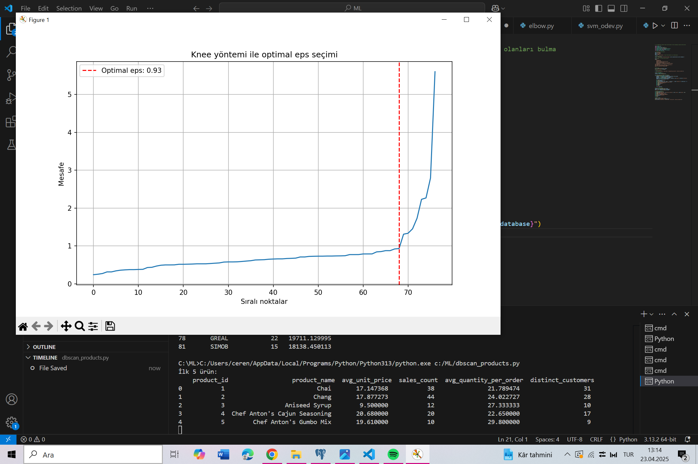
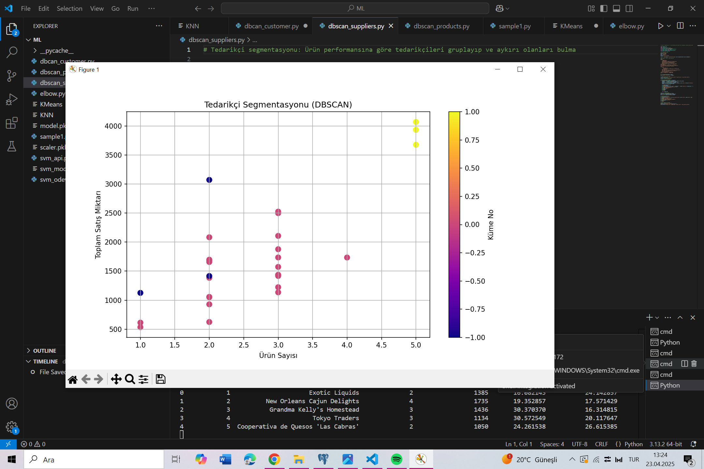
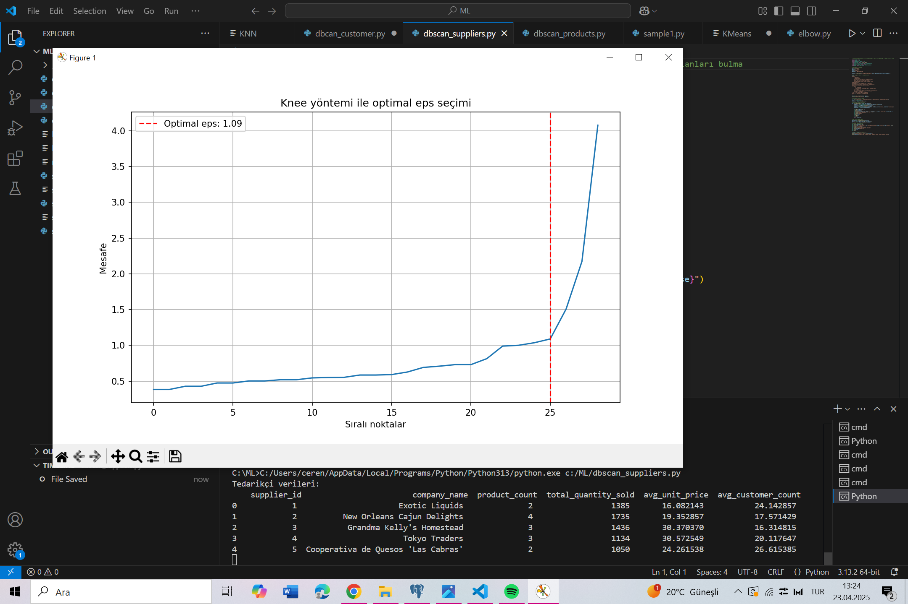
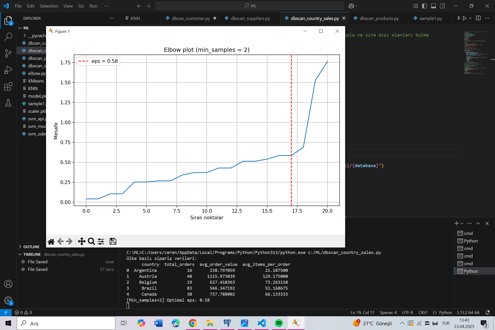
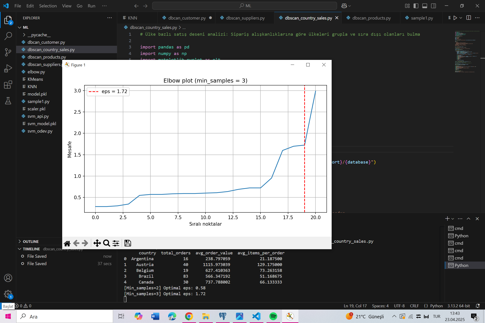
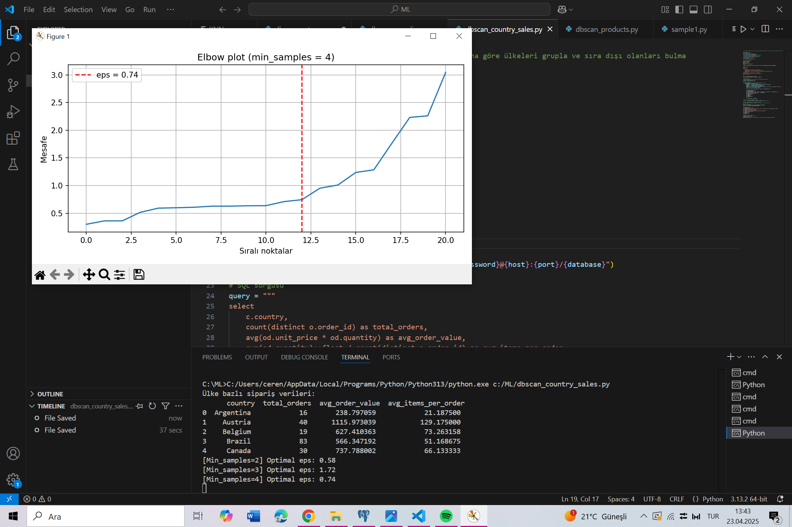
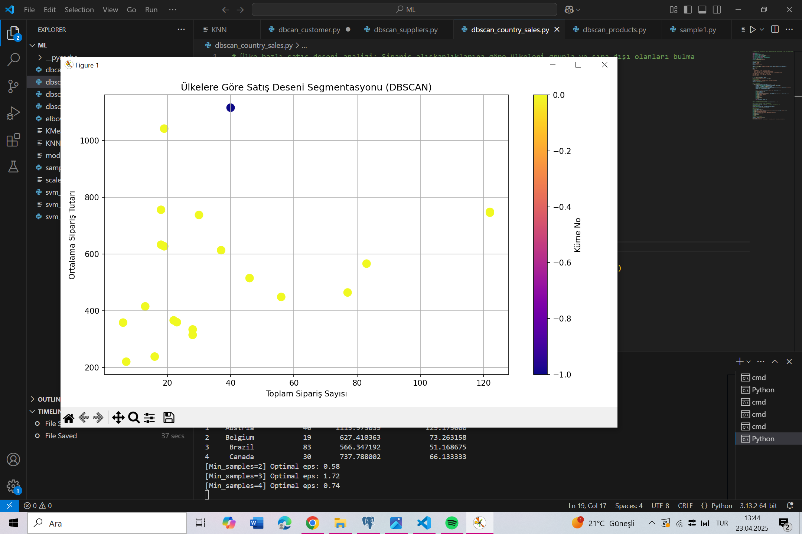

# Northwind DBSCAN Segmentasyon Projesi

Bu proje, Northwind veritabanı üzerinde DBSCAN algoritması kullanılarak:

- Müşteri segmentasyonu  
- Ürün segmentasyonu  
- Tedarikçi segmentasyonu  
- Ülke bazlı satış alışkanlıklarının analizi  

yapmak üzere geliştirilmiştir. Ayrıca FastAPI ile bu analizler birer **API servisi** haline getirilmiştir.

---

##  Kullanılan Teknolojiler

- Python 3
- PostgreSQL (Northwind verisi)
- Pandas, Scikit-learn, Matplotlib
- FastAPI
- DBSCAN (Yoğunluk Tabanlı Kümeleme)
- Uvicorn (API sunucusu)

---

## API Endpointleri

| Endpoint            | Açıklama                                 |
|---------------------|------------------------------------------|
| `/products`         | Ürünleri satış davranışına göre gruplar |
| `/suppliers`        | Tedarikçileri ürün performansına göre gruplar |
| `/countries`        | Ülkeleri sipariş alışkanlıklarına göre gruplar |

Swagger arayüzü: [http://127.0.0.1:8000/docs](http://127.0.0.1:8000/docs)

---

🚀 Projeyi Çalıştırma

```bash
uvicorn product_supplier_api:app --reload

 📊 Ürün Segmentasyonu Sonucu

**Yorum: Ürünler satış sıklığı ve müşteri sayısına göre gruplanmıştır. -1 numaralı kümede yer alan ürünler, düşük talep gören ya da niş ürünlerdir.

 📈 EPS Değeri Belirleme (Ürün)

**Yorum: Knee yöntemi ile ürün segmentasyonu için optimal `eps` değeri 0.93 olarak belirlenmiştir. Bu değer, DBSCAN algoritmasında komşuluk sınırını tanımlar.

 📊 Tedarikçi Segmentasyonu

**Yorum: Tedarikçiler ürün çeşitliliği ve satış performansına göre segmentlere ayrılmıştır. Aykırı olanlar, katkısı düşük veya sadece birkaç ürün sağlayan tedarikçilerdir.

 📈 EPS Belirleme (Tedarikçi)

**Yorum: Tedarikçilerin ürün sayısı ve toplam satış miktarına göre elbow noktası ile optimal `eps` değeri belirlenmiştir. DBSCAN, bu eşik değerle kümeleri ayırır.

 📈 EPS Karşılaştırması (Ülke)



**Yorum: Farklı `min_samples` değerlerine göre knee yöntemi kullanılarak optimal `eps` değerleri hesaplanmıştır. DBSCAN’in duyarlılığı bu şekilde optimize edilmiştir.

 📊 Ülke Segmentasyonu

Yorum:  Ülkeler, sipariş sayısı ve ortalama sipariş tutarına göre kümeleme ile gruplanmıştır. Aykırı (-1) olarak tespit edilen ülkeler, alışılmadık sipariş desenine sahiptir.


